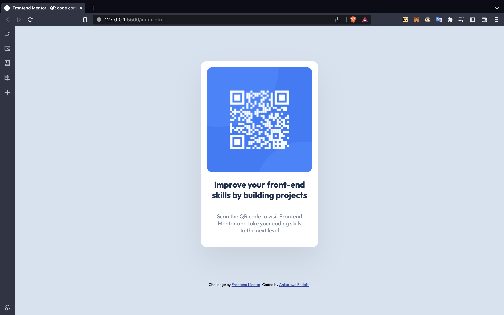

# Frontend Mentor - QR Code Component Solution 

- This is my first submission for [frontend mentor](https://www.frontendmentor.io/home) challenges. 

- It's a simple QR Code Implementation.

Built With:

- This is just built with HTML and CSS.
- Flexbox
- CSS Grid

Screenshot:

